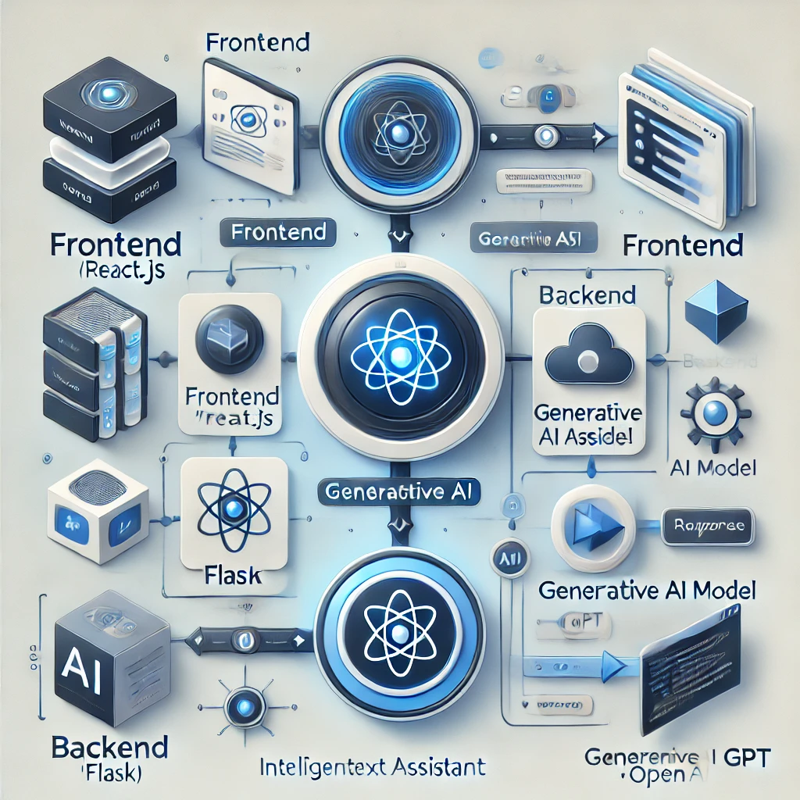

# Intelligent-Text-Assistant-Using-Generative-AI
This project focuses on creating an intelligent text assistant powered by Generative AI, capable of processing, understanding, and generating human-like text. The assistant leverages pre-trained models such as OpenAI's GPT (Generative Pre-trained Transformer) to provide a seamless conversational experience. It can be integrated into various applications, including customer support, content creation, and personal productivity tools.

**Features**
1. Natural Language Understanding:
    * Ability to comprehend and process user input in a conversational format.
    * Supports multiple intents and contextual understanding.

2. Text Generation:

3. Generates human-like responses using generative AI models.
   * Supports tasks like text summarization, translation, and content creation.

4. Personalized Assistance:

   * Learns user preferences over time to provide personalized responses.
   * Handles multi-turn conversations with contextual memory.

5. Integrations:

   * Can be deployed in chatbots, voice assistants, and web applications.
   * Compatible with APIs for integration into existing systems.
6. Extensibility:

   * Supports integration with additional machine learning libraries for sentiment analysis, text classification, and more.

**Tech Stack**
* **Backend**: Python (Flask or FastAPI)
* **Frontend**: React.js (optional for UI-based assistants)
* **Generative AI Models**: OpenAI GPT-4, Hugging Face Transformers
* **Libraries**:
  * transformers
  * torch (PyTorch)
  * flask or fastapi
  * openai (for OpenAI API integration)
  * nltk (for natural language processing)
* **Deployment**: Docker, AWS/GCP/Azure for cloud deployment

**How It Works**
1. **Input Processing:**

   * User input is processed and tokenized.
   * The assistant identifies intent and extracts context from previous messages.
2. **Generative Model Integration:**

   * Pre-trained AI models (like GPT) generate responses based on input.
   * Custom fine-tuned models can also be integrated for specific tasks.

3. **Output Generation:**

   * The assistant generates a meaningful and contextually relevant response.
   * Optionally integrates tools like sentiment analysis to modify tone.
